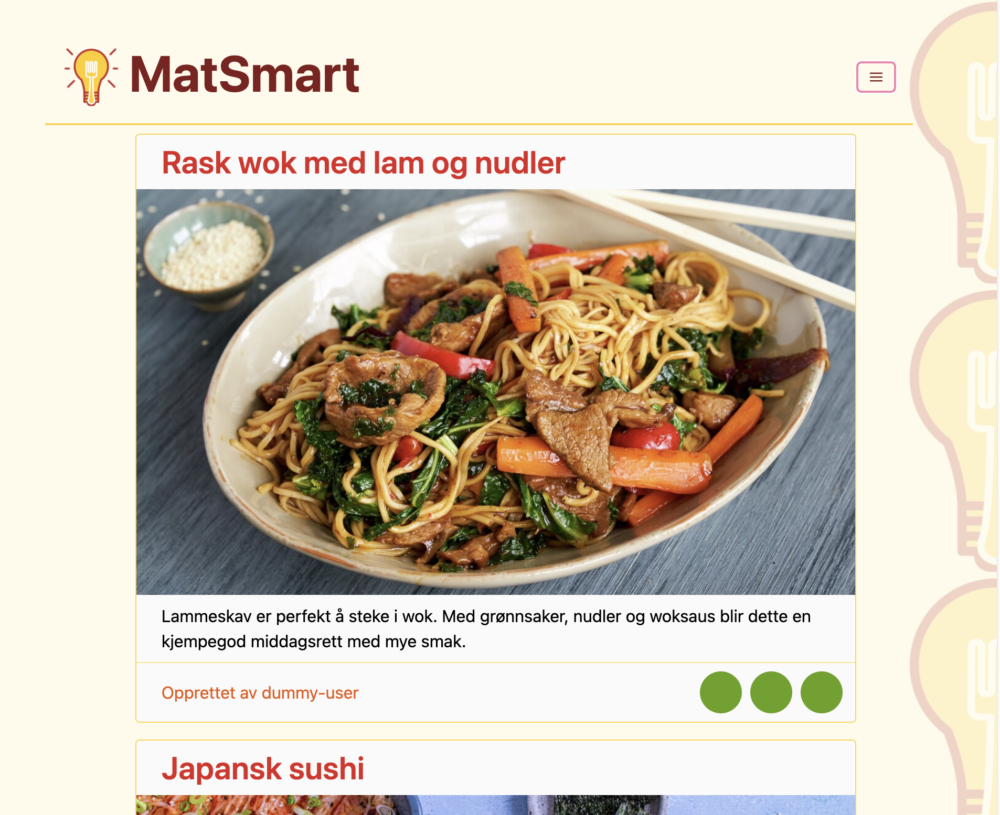
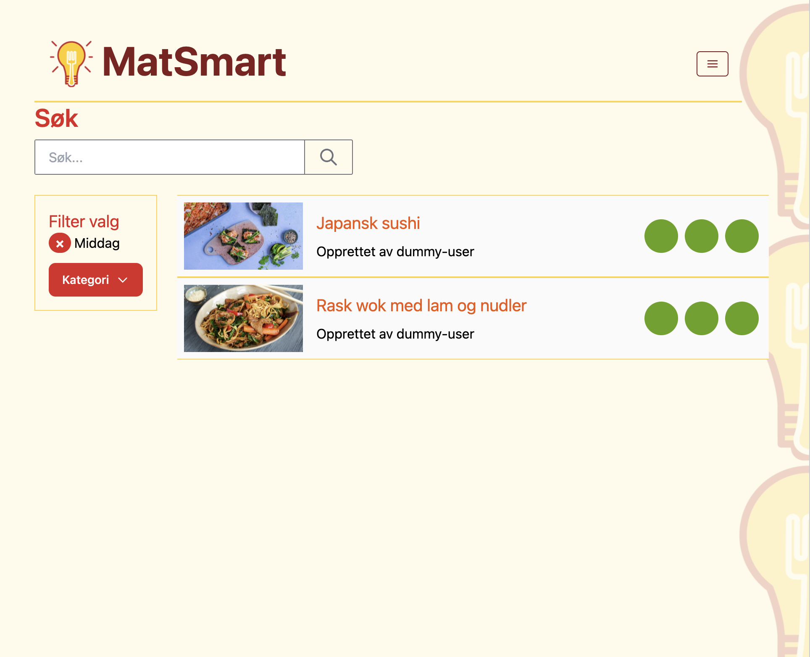

# Matsmart ![Matsmart-logo][logo]

Gruppeprosjekt i [TDT4140](https://www.ntnu.no/studier/emner/TDT4140) fra 2. klasse på NTNU. Teknologistakken inkluderer [Django](https://www.djangoproject.com/), [PostgreSQL](https://www.postgresql.org/), [Tailwind CSS](https://tailwindcss.com/) og [docker](https://www.docker.com/). Hovedfokuset i emnet var på [Scrum](https://no.wikipedia.org/wiki/Scrum)-prosessen og ikke nødvendigvis på bruk av teknologi. Vi simulerte et kundestyrt prosjekt hvor vi konferte ukentlig med en ekstern produkteier, planla og gjennomføre flere sprinter, avholdt to produktdemonstrasjoner og benyttet parprogrammering. Vi eksperimenterte og evaluerte flere smidige utviklingspraksiser fra pensum underveis.

## Produktbeskrivelse
Under følger den originale produktbeskrivelsen fra produkteier.


> **Produktvisjon**
> Gjøre deling av matoppskrifter så enkelt, informativt og effektivt som mulig.
>
> **Beskrivelse**
> Jeg står ofte i butikken uten å vite hva jeg skal lage til middag. Dette tror jeg er noe flere kjenner seg igjen i, og jeg ønsker derfor en løsning som kan hjelpe meg med oppskrifter både i hverdagen og til festligheter.
> 
> Jeg vil ha en strukturert plattform der man kan opprette, dele og lett finne frem til oppskrifter på matretter. Jeg vil ha persistent lagring av data på plattformen (Oppskrifter, brukere, o.l.). I tillegg hadde jeg satt pris på kategorisering av oppskrifter, samt muligheten for å rangere en rett jeg har prøvd.
> 
> For å sikre seriøse brukere ønsker jeg at man må logge seg inn med passord på egen bruker for å få tilgang til oppskriftene på applikasjonen (dere kan bestemme selv om dere vil lage en MVP uten innlogging for å komme raskt i gang med arbeidet). Hver bruker skal ha mulighet til å legge inn (og redigere) bilde, beskrivelse og andre elementer som skal være synlig for andre. Jeg ønsker også at oppskrifter er knyttet til brukerne som opprettet disse. Jeg ønsker også at eieren av plattformen skal kunne slette oppskrifter, og brukere som bryter retningslinjer.
> 
> Jeg har ikke bestemt om det skal være mobil-app eller nettside, men det er viktig med et bra design.

## Skjermdumper

<details>
    <summary>
        <h3>Oppskriftsoversikt</h3>
    </summary>
    
</details>

<details>
    <summary>
        <h3>Søkefunksjonalitet</h3>
    </summary>
    
</details>

<details>
    <summary>
        <h3>Mobilversjon</h3>
    </summary>
    
</details>

## Installasjon

Prosjektet MatSmart er satt opp i Docker. Dette er gjort for å sikre lik deployment uansett operativsystem, og for å streamline installasjonsprosessen.

1. Installer [](https://docs.docker.com/engine/install/)
2. Bygg og start applikasjonen:
   ```
   docker-compose up
   ```

<details>
    <summary>
        <b>Merknad for Windows-brukere</b>
    </summary>

Windows bruker Git sin Bash interpreter til å kjøre django_entrypoint.sh, som forventer linjeskift i UNIX-stil. Git vil automatisk endre unix stil linjeskift til dos ved `git pull` på windows. For at scriptet skal kjøres uten feil må linjeskiftstilen endres.
Dette kan gjøres i de fleste tekstredigeringsverktøy, eller under [WSL](https://docs.microsoft.com/en-us/windows/wsl/install) med verktøyet [dos2unix](https://www.computerhope.com/unix/dos2unix.htm).

</details>

---

## Adminpanel

| Brukernavn | Passord | URL                                       |
| :--------- | :------ | :---------------------------------------- |
| admin      | matvrak | [adminpanel](http://localhost:8000/admin) |

---

## Django-apps og intern linking

- Apps ligger i [matsmart/apps](matsmart/apps/) og HTML templates legges i **matsmart/apps/** navn-på-app **/templates/**.
- I filen `urls.py` for hver app kobles URLer med funksjoner. Eksempel:

```python
app_name = 'navn-på-app'

# create a list of URL patterns corresponding to various view functions
urlpatterns = [
    path('', views.profile_page, name='profile_page_self'),
    path("logg-inn/", views.login_request, name="login"),
    path("logg-ut/", views.logout_request, name="logout"),
]
```

- `app_name` og `urlpattern name` kan refereres til globalt. F.eks. kan en link i en HTML-template se slik ut:

```html
<a href="">Logg inn</a>
```

---

## Tester

#### Kjør tester
Kjør `coverage run` (fra samme mappe som `manage.py`).

#### Testdekningsgrad
[coverage.py](https://coverage.readthedocs.io) gir oversikt via `coverage report -m` eller `coverage html` 

[logo]: docs/img/matsmart-logo.png "Matsmart"